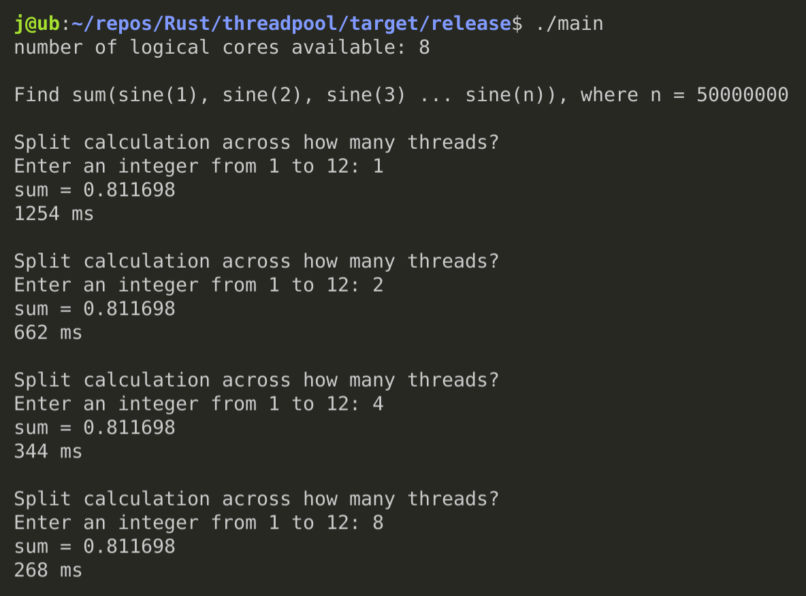

# threadpool

My, rather naive, implementation (see [main.rs](https://github.com/jinjagit/threadpool/blob/main/src/bin/main.rs)) of Ryan Levicks's Rust threadpool library (see [lib.rs](https://github.com/jinjagit/threadpool/blob/main/src/lib.rs)), from [his tutorial](https://www.youtube.com/watch?v=2mwwYbBRJSo).  

Learning to use Arc, Mutex, Atomic variables, and developing understanding of ownership, borrowing and closures.  

## compile to release version

Assuming you have Rust installed, remember to compile to a release build to evaluate the real differences in performance due to varying thread numbers sharing the calculation:
* clone repo.  
* `$ cd threadpool`  
* `$ cargo build --release`  
* `$ cd target/release`  
* `$ ./main`  

## example output

